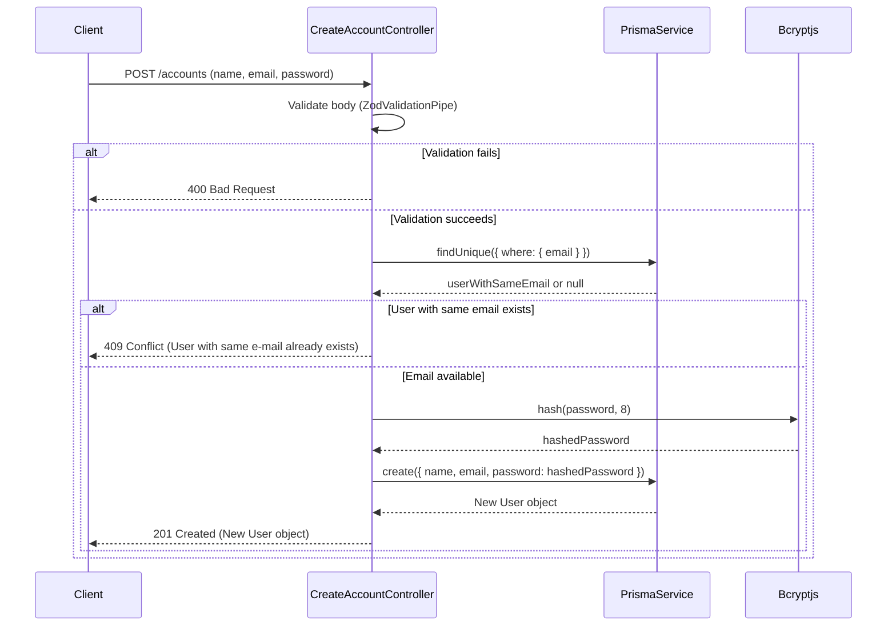
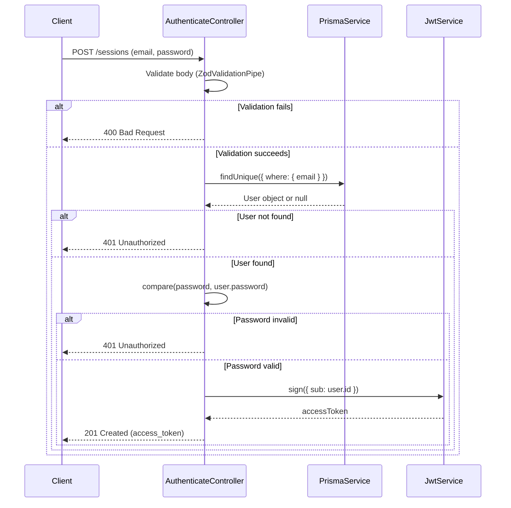
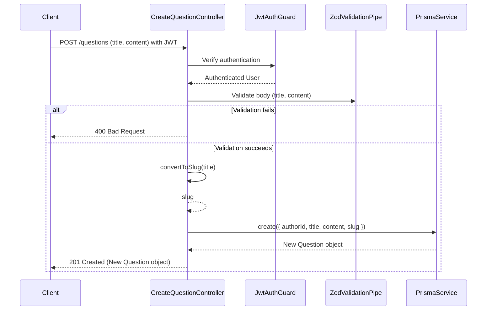
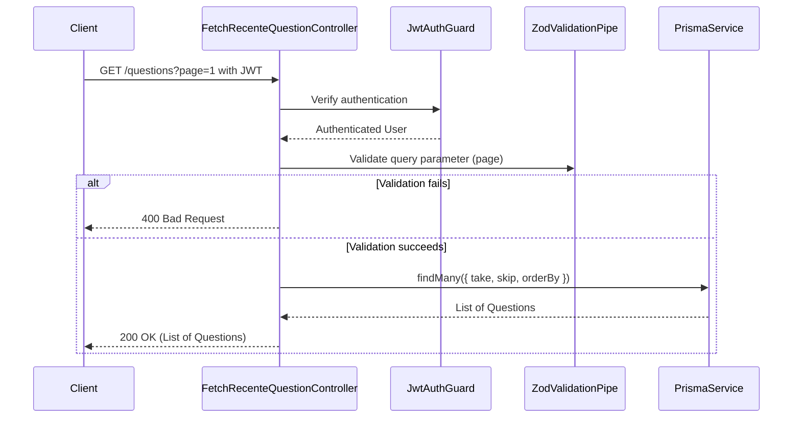

# Projeto de API com NestJS, Prisma, JWT, e Zod

Este projeto é uma API desenvolvida com **NestJS**, que inclui funcionalidades de criação de contas, autenticação, criação e listagem de perguntas. A API utiliza **Prisma** como ORM, **JWT** para autenticação, e **Zod** para validação de dados.

## Tecnologias Utilizadas

- **NestJS**: Framework Node.js para construção de aplicações server-side eficientes e escaláveis.
- **Prisma**: ORM que facilita o acesso ao banco de dados e manipulação de dados.
- **JWT (JSON Web Token)**: Utilizado para autenticação segura entre cliente e servidor.
- **Zod**: Biblioteca de validação de esquemas para validação de dados de entrada.
- **Bcryptjs**: Biblioteca para hashing de senhas de forma segura.

## Funcionalidades

### 1. Criação de Conta

- Endpoint: `POST /accounts`
- Descrição: Permite a criação de uma nova conta de usuário.
- Validação: O corpo da requisição é validado com **Zod**. Se a validação falhar, uma resposta `400 Bad Request` é retornada.
- Segurança: Se o e-mail já estiver cadastrado, uma resposta `409 Conflict` é retornada.
- Diagrama de sequência:



### 2. Autenticação de Usuário

- Endpoint: `POST /sessions`
- Descrição: Permite a autenticação de um usuário e retorna um token JWT.
- Validação: O corpo da requisição é validado com **Zod**. Se a validação falhar, uma resposta `400 Bad Request` é retornada.
- Segurança: Se as credenciais estiverem incorretas, uma resposta `401 Unauthorized` é retornada.
- Diagrama de sequência:



### 3. Criação de Pergunta

- Endpoint: `POST /questions`
- Descrição: Permite a criação de uma nova pergunta por um usuário autenticado.
- Validação: O corpo da requisição é validado com **Zod**. Se a validação falhar, uma resposta `400 Bad Request` é retornada.
- Segurança: Requer autenticação JWT.
- Diagrama de sequência:



### 4. Listagem de Perguntas

- Endpoint: `GET /questions?page=1`
- Descrição: Permite a listagem de perguntas com paginação.
- Validação: O parâmetro de query `page` é validado com **Zod**. Se a validação falhar, uma resposta `400 Bad Request` é retornada.
- Segurança: Requer autenticação JWT.
- Diagrama de sequência:



## Como Executar o Projeto

### Pré-requisitos

- Node.js instalado
- Banco de dados configurado (MySQL, PostgreSQL, etc.)
- Dependências instaladas via `pnpm` ou `npm`

### Passos

1. Clone o repositório:
   ```bash
   git clone https://github.com/BrunoFelixDeSousa/project-with-prisma-template.git
   ```
2. Instale as dependências:
   ```bash
   pnpm install
   ```
3. Configure as variáveis de ambiente no arquivo `.env`.
4. Execute as migrações do banco de dados:
   ```bash
   pnpm prisma migrate dev
   ```
5. Inicie o servidor de desenvolvimento:
   ```bash
   pnpm start:dev
   ```
   