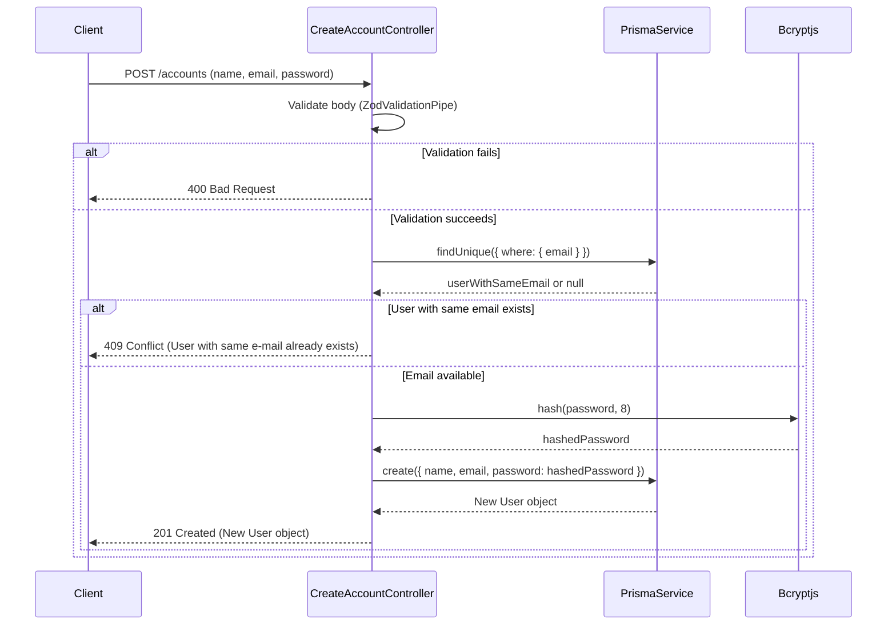
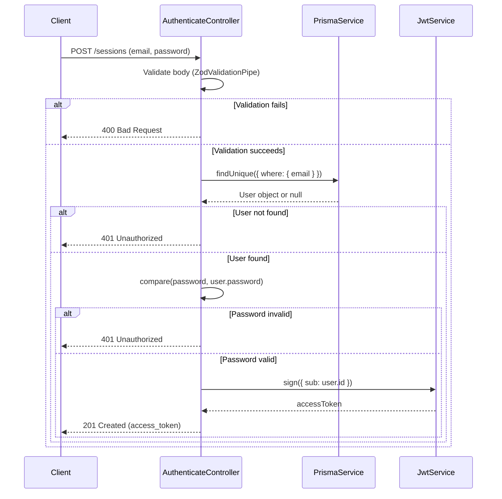
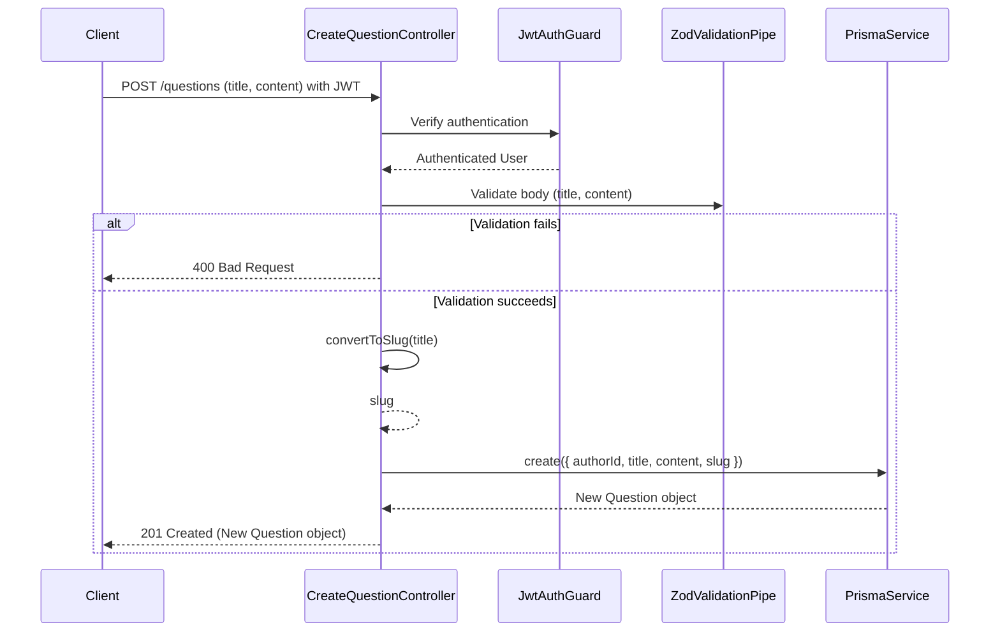
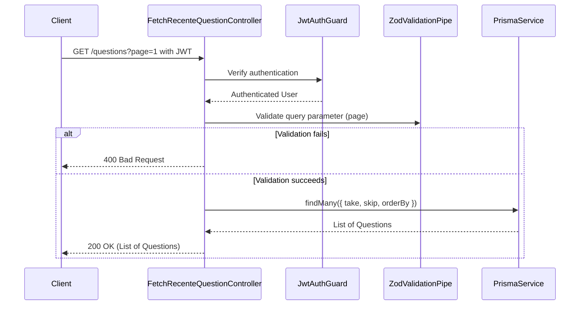

# Diagrama de sequência das classes controller

## Fluxo de criação de conta no método handle da classe CreateAccountController

## Fluxo de autenticação no método handle da classe AuthenticateController

## Fluxo de criação de pergunta no método handle da classe CreateQuestionController

## Fluxo de listagem de perguntas no método handle da classe FetchRecenteQuestionController

