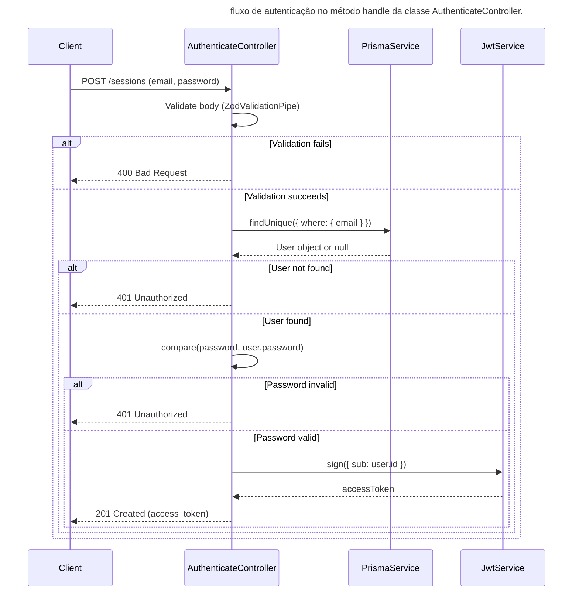

```mermaid
    sequenceDiagram
        title fluxo de autenticação no método handle da classe AuthenticateController.

        participant Client
        participant AuthenticateController
        participant PrismaService
        participant JwtService

        Client->>AuthenticateController: POST /sessions (email, password)
        AuthenticateController->>AuthenticateController: Validate body (ZodValidationPipe)
        alt Validation fails
            AuthenticateController-->>Client: 400 Bad Request
        else Validation succeeds
            AuthenticateController->>PrismaService: findUnique({ where: { email } })
            PrismaService-->>AuthenticateController: User object or null
            
            alt User not found
                AuthenticateController-->>Client: 401 Unauthorized
            else User found
                AuthenticateController->>AuthenticateController: compare(password, user.password)
                alt Password invalid
                    AuthenticateController-->>Client: 401 Unauthorized
                else Password valid
                    AuthenticateController->>JwtService: sign({ sub: user.id })
                    JwtService-->>AuthenticateController: accessToken
                    AuthenticateController-->>Client: 201 Created (access_token)
                end
            end
        end


```